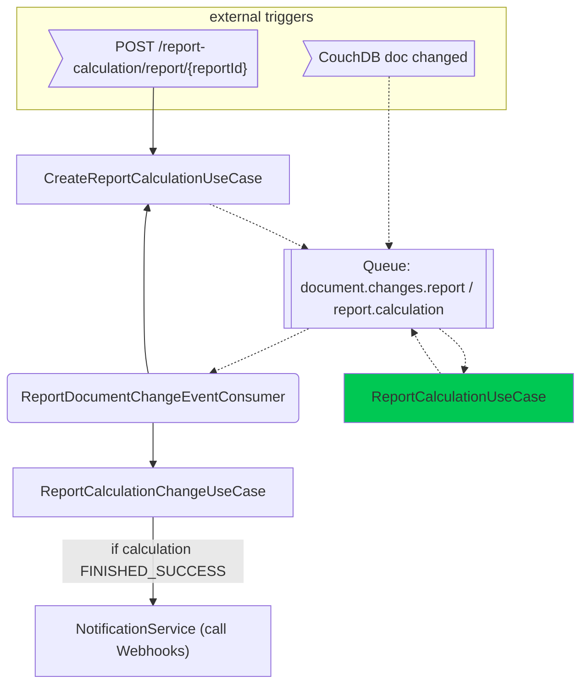

# Reporting Module (implementation)
_for details about setup & usage of this module [see README in docs folder](../../../../../../../../../docs/modules/reporting.md)_

## Use Case / Flow
This backend module uses CouchDB [Structured Query Service (SQS)](https://neighbourhood.ie/products-and-services/structured-query-server)
to execute SQL queries on the Aam Digital system's database.
Queries are defined in as `ReportConfig` entities in the CouchDB and triggered through API requests.
Results are persisted in a separate "report-calculation" CouchDB and returned through API requests.

Processing is asynchronous and decoupled using RabbitMQ messages.

