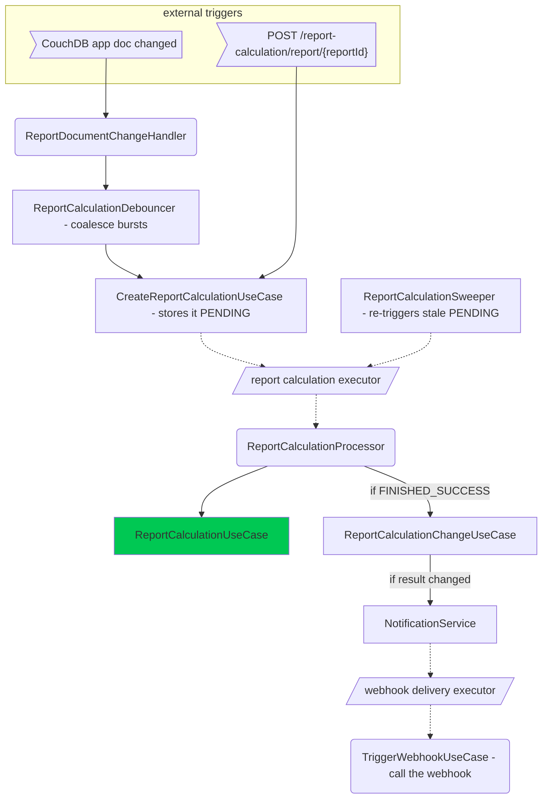

# Reporting Module (implementation)
_for details about setup & usage of this module [see README in docs folder](../../../../../../../../../docs/modules/reporting.md)_

## Use Case / Flow
This backend module uses CouchDB [Structured Query Service (SQS)](https://neighbourhood.ie/products-and-services/structured-query-server)
to execute SQL queries on the Aam Digital system's database.
Queries are defined in as `ReportConfig` entities in the CouchDB and triggered through API requests.
Results are persisted in a separate "report-calculation" CouchDB and returned through API requests.

Calculations are processed asynchronously on a bounded executor, so a handful of multi-second SQS
queries can be in flight without overwhelming SQS and without holding up the caller. Once a
calculation has stored a new result the subscribed webhooks are called on a second bounded executor,
so a slow subscriber cannot hold up the calculation either.

```mermaid
flowchart TD
    subgraph trigger[external triggers]
        calculationRequest>"POST /report-calculation/report/{reportId}"]
        externalDocChange>"CouchDB app doc changed"]
    end

    externalDocChange --> ChangeHandler
    ChangeHandler(ReportDocumentChangeHandler) --> Debouncer
    Debouncer[ReportCalculationDebouncer - coalesce bursts] --> CreateCalculation
    calculationRequest --> CreateCalculation

    CreateCalculation[CreateReportCalculationUseCase - stores it PENDING] -.-> E_Calculation
    E_Calculation[/report calculation executor/] -.-> CalculationProcessor
    Sweeper[ReportCalculationSweeper - re-triggers stale PENDING] -.-> E_Calculation
    CalculationProcessor(ReportCalculationProcessor) --> Calculation
    Calculation[ReportCalculationUseCase]
    style Calculation fill:#00C853

    CalculationProcessor -- if FINISHED_SUCCESS --> CalculationChange
    CalculationChange[ReportCalculationChangeUseCase] -- if result changed --> WebhookNotification
    WebhookNotification["NotificationService"] -.-> E_Webhook
    E_Webhook[/webhook delivery executor/] -.-> TriggerWebhook
    TriggerWebhook(TriggerWebhookUseCase - call the webhook)
```

## Caches on the automatic change-detection path

`ReportDocumentChangeHandler` runs for every changed document in the `app` database (up to
`CHANGES_LIMIT = 100` per poll tick) and, since change handling is synchronous, on the polling
thread itself - so nothing on that path may do per-change CouchDB I/O.
Two caches keep it in memory:

- **`ReportConfigCache`** — `reportId -> affected entity types`, i.e. the result of
  `SimpleReportQueryAnalyser`'s SQL regex, computed once per report definition instead of once per
  document change. Marked stale by `DefaultIdentifyAffectedReportsUseCase` whenever a
  `ReportConfig:*` change arrives, which is the only thing that can change it: `ReportConfig`
  documents live in `app`, the one database in `database-change-detection.included-databases`.
- **`WebhookSubscriptionCache`** — the set of report ids that any webhook is subscribed to. It
  reads `WebhookEntity` documents directly, so it never decrypts a webhook secret. Webhooks live
  in the `notification-webhook` database, which is deliberately *not* polled for changes, so this
  cache is invalidated by `DefaultWebhookStorage` (the only writer of that database) and,
  additionally, expires after `reporting.webhook-subscription-cache.ttl-millis` (default 1000) to
  bound staleness from writes this process cannot see.

  It is intentionally not used by `GET /v1/reporting/webhook` or by `NotificationService`, which
  must always see the current webhook list.
