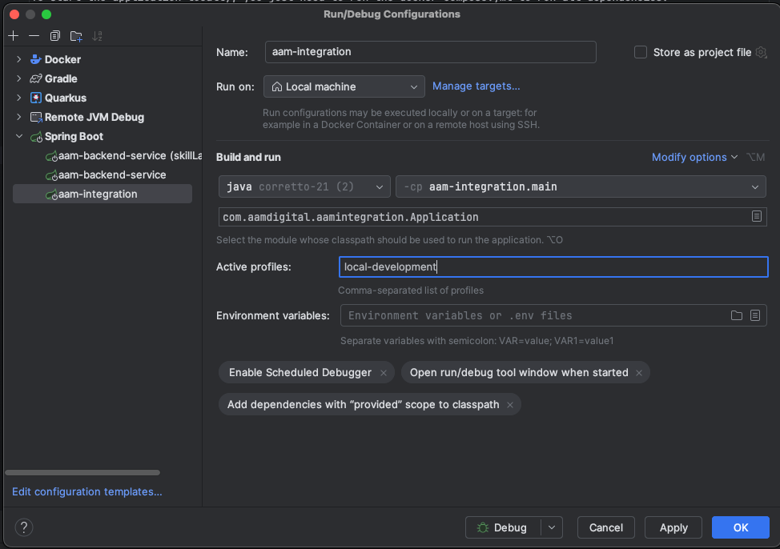
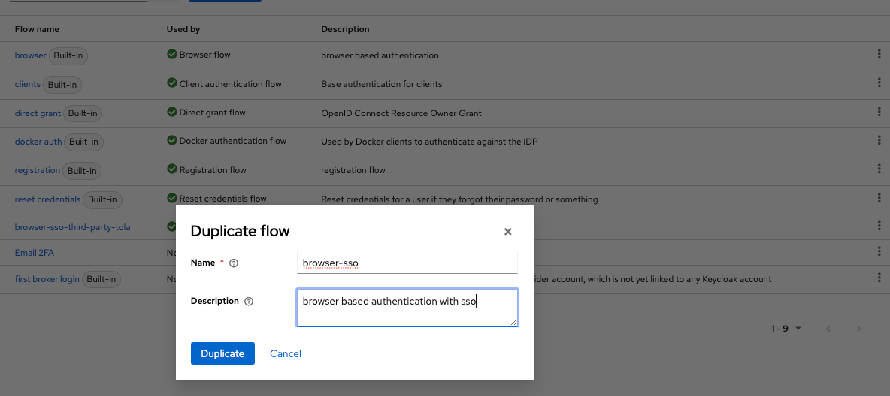
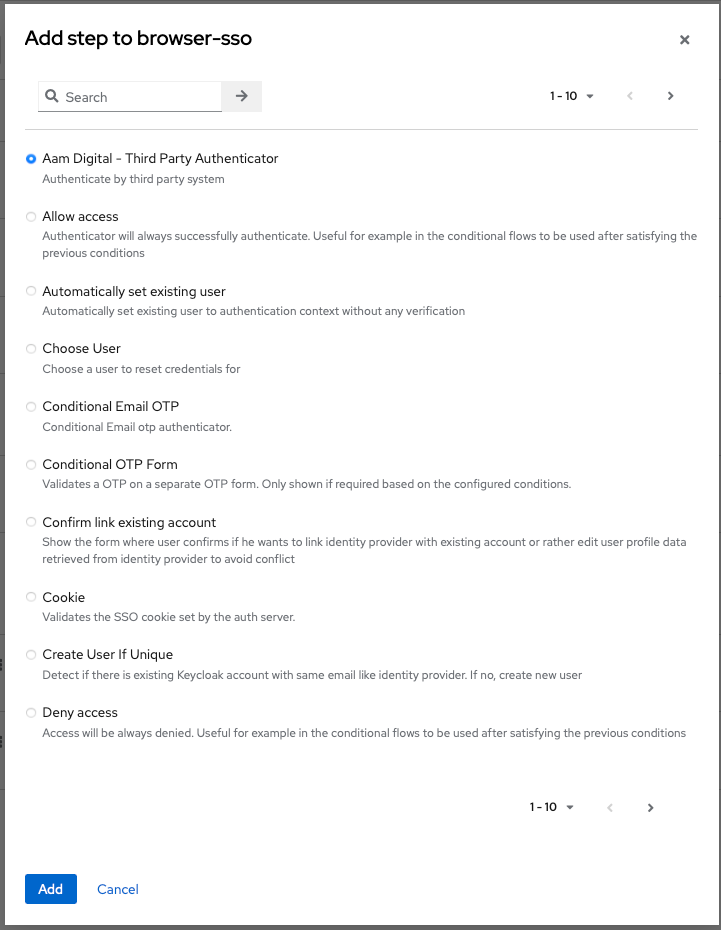
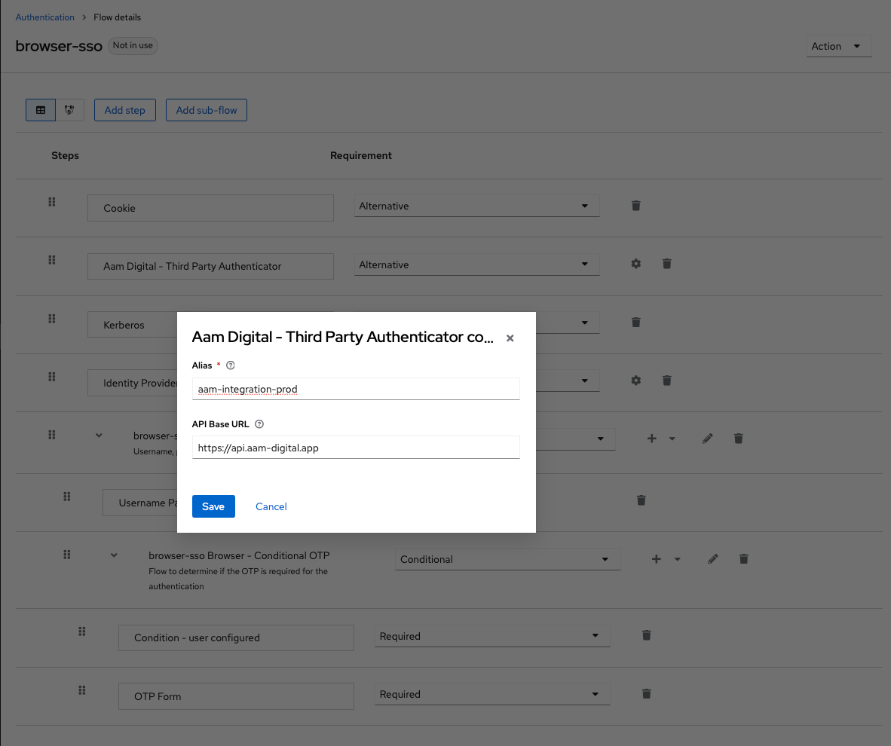
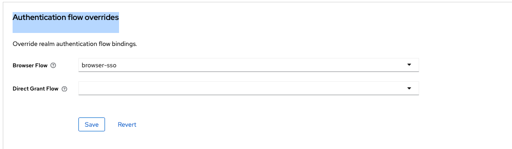

# aam-integration

This application provides a third-party-integration API to authenticate external users.

## Developer Guide

To start the application locally, you just need to run the docker-compose.yml to run all dependencies:

```
docker compose up -d
```

This will spin up instances of all services needed, except for the keycloak server. You can re-use the instance from
the [developer-setup](../../docs/developer/docker-compose.yml).

After all services are running, you can start the application with a spring-boot configuration over IntelliJ


Make sure, to enable the `local-development` profile.

That's it. Check out the API Spec and make some requests.

## Api Specs

- [Third-Party-Authentication](../../docs/api-specs/third-party-authentication-api-v1.yaml)

## Keycloak Setup

You need to configure your Keycloak Realm to support the third-party-api. Check out the provider:
`application/keycloak-third-party-authentication`

### Enable the third-party-authentication provider in keycloak

This is already done in the default aam-keycloak image.

### Create an Authentication Flow

Go to the `Auhtentication` Settings in your Realm and copy the default `browser` flow and name it `browser-sso`.



Click on `Add step` and select `Aam Digital - Third Party Authenticator`. It will be placed at the end of the list.



- Now move the `Aam Digital - Third Party Authenticator` block between `Cookie` and `Kerberos`.
- Set the `Requirement` to `Alternative`
- Click on the settings icon on the right.
- Fill in the `Alias` and the `API-Base Url`



Save the Flow and switch to: `Clients` -> `app` -> `Advanced` and scroll down to `Authentication flow overrides`

Select the `browser-sso` flow here:



Done. The Third-Party-Api should now be usable.
