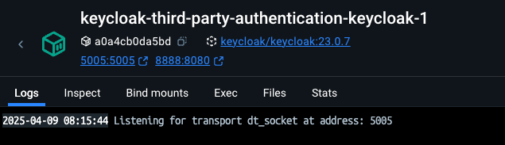
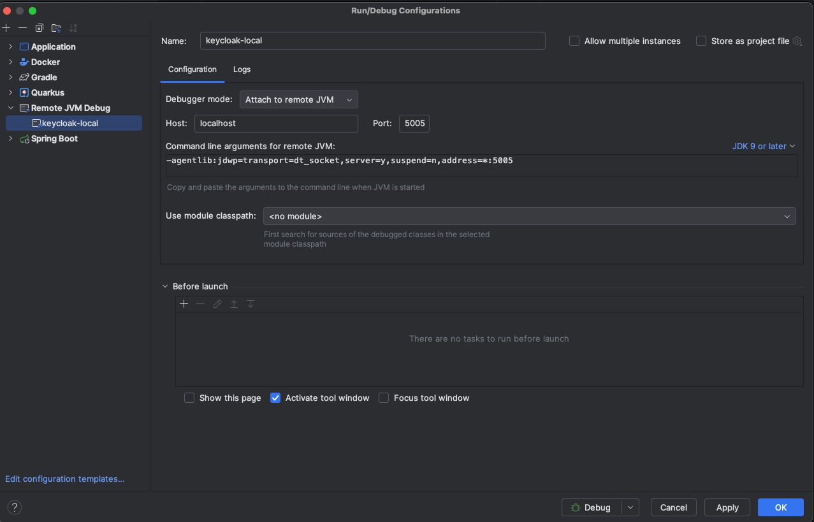
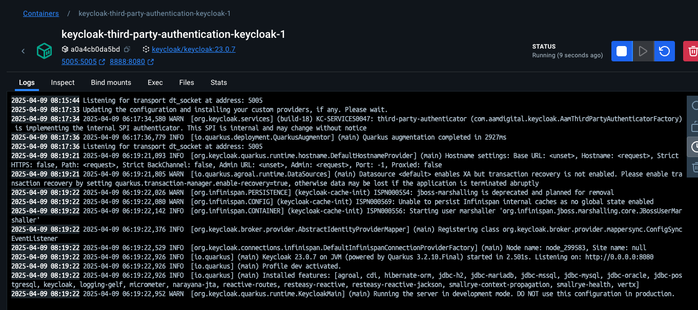

# keycloak-third-party-authentication

This provider extension for Keycloak is alternative sign-in flow to enable third party authentication.

For an explanation of the feature overall, please refer to the [Module's README](/docs/modules/aam-integration.md).

This is required as a counterpart to our API's [aam-integration module](./application/aam-integration/README.md).
It interacts with our API to authenticate a Keycloak user based on the session tokens managed by the aam-integration API.


## Setup
The .jar file built here (e.g. through the CI) should be built into a Keycloak image to make it available.
We build our custom Keycloak image with necessary providers in [Aam-Digital/aam-cloud-infrastructure](https://github.com/Aam-Digital/aam-cloud-infrastructure/blob/main/application/aam-keycloak/Dockerfile).


## Development

As development setup, you can use the provided [docker-compose.yml](./docker-compose.yml).

### Enable debugging

To debug into the keycloak JVM, you need to enable the debug options in the [docker-compose.yml](./docker-compose.yml):

```yaml
name: keycloak-third-party-authentication
services:
  keycloak:
    environment:
      DEBUG: 'true'
      DEBUG_SUSPEND: 'y'
      DEBUG_PORT: '*:5005'
```

After that, you can start the containers `docker compose up -d`. You will see, that the keycloak container is waiting
for a
debugger to attach:



Now create a Remote JVM Debug configuration in your IntelliJ:



... start the configuration in debug mode. You will see, that the container is logging the connection now:



**Attention**: sometimes, you need to start the debug configuration twice.

Done. Breakpoints should work as usual now.
