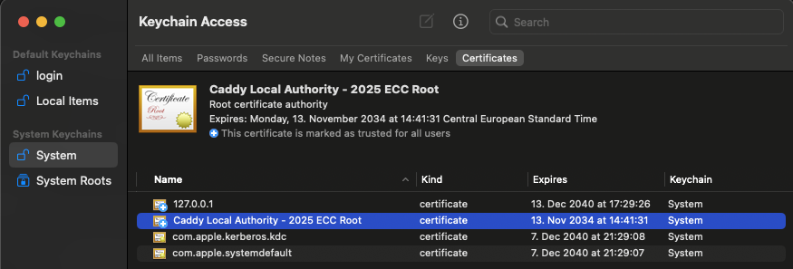
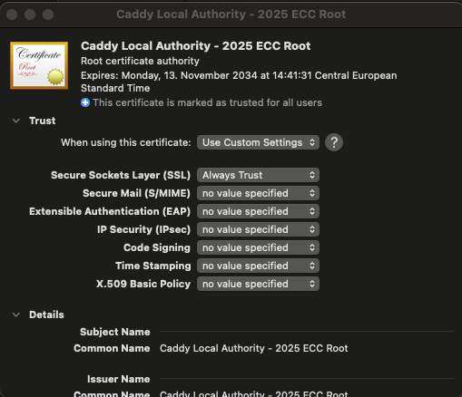
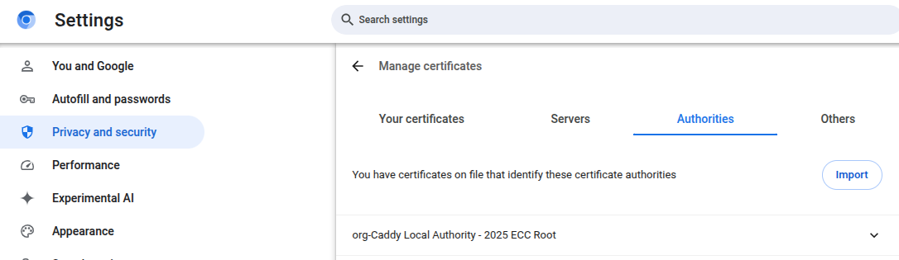

## Overview

The aam-digital stack contains multiple services from different repositories wich are developed and maintained by
aam-digital.  
For some features, we also use third party solutions that are maintained from the respective development team.

### managed by aam-digital (public)

- *ndb-core*: main angular frontend application [GitHub](https://github.com/Aam-Digital/ndb-core)
- *replication-backend*: (optional) layer between frontend and the couchdb for handling document
  permissions [GitHub](https://github.com/Aam-Digital/replication-backend)
- *aam-backend-services*: main backend spring boot application, modulith
  architecture [GitHub](https://github.com/Aam-Digital/aam-services/tree/main/application/aam-backend-service)

additionally, as multi-tenant services:

- *account-backend*: simple backend service to handle user account related tasks for the frontend in
  Keycloak [GitHub](https://github.com/Aam-Digital/account-backend)
- *ndb-admin*: API for general admin functionality like statistics and config migrations on
  databases [GitHub](https://github.com/Aam-Digital/ndb-admin)

### managed by aam-digital (private)

Accessible for aam-digital internals and contributors only.

- *aam-external-mock-service*: mock of external systems are subject to a duty of non-disclosure in some cases.

---

### used by aam-digital stack, managed by third party (public)

- *couchdb*: Seamless multi-master syncing database with an intuitive HTTP/JSON API, designed for
  reliability [GitHub](https://github.com/apache/couchdb)
- *postgresql*: PostgreSQL is an advanced object-relational database management
  system [GitHub](https://github.com/postgres/postgres)
- *keycloak*: Open Source Identity and Access Management For Modern Applications and
  Services [GitHub](https://github.com/keycloak/keycloak)
- *rabbitmq-server*: Multi-protocol messaging and streaming
  broker. [GitHub](https://github.com/rabbitmq/rabbitmq-server)
- *carbone*: Fast, Simple and Powerful report generator in any format [GitHub](https://github.com/carboneio/carbone)

### used by aam-digital stack, managed by third party (private)

Accessible for aam-digital internals and contributors only.

- *structured-query-server (sqs)*: An SQL query engine for CouchDB, letting you use SQL SELECT statements to extract
  information from a CouchDB
  database. [Homepage](https://neighbourhood.ie/products-and-services/structured-query-server)

---

### third party tools used for development (public)

- [maildev](https://github.com/maildev/maildev): Local SMTP server with web interface for testing during development.
- [caddy](https://github.com/caddyserver/caddy): Multi-platform HTTP/1-2-3 web server with automatic HTTPS.

-----

## Running a full system locally

After completing the setup steps below once
you can simply use the docker compose file in this directory:

```shell
docker compose up -d
```

(!) Make sure to access the frontend at [http://aam.localhost/](http://aam.localhost/)
instead of "localhost:4200". Otherwise, the connections to backend services like sync will not work.

Also see the "Tips and tricks" section at the end of this file for possible adjustments.

-----

## Setup of development environment

To make development as simple as possible, we provide all services as docker containers. You can start them with the
docker-compose file provided [here in this folder](./docker-compose.yml)  
All container will communicate directly over a separate docker network: `aam-digital`

You need to create the docker network initial:

```bash
docker network create aam-digital
```

##### (bugfix) macOS with M4:

Fix bug on M4 chips with Sequoia 15.2: https://github.com/corretto/corretto-21/issues/85:

Add this to your .env file:

```env
JAVA_TOOL_OPTIONS="-XX:UseSVE=0"
```

---

### reverse-proxy

The stack includes a caddy reverse-proxy that runs on https://aam.localhost/ - SSL is enabled by default. However, this
certificate is self-signed and must be added manually as trustworthy.

You also need to adapt your `/etc/hosts` file and add an entry for `aam.localhost` to `127.0.0.1`:

```bash
sudo nano /etc/hosts
```

Add another line for `aam.localhost`:

```
127.0.0.1       localhost
127.0.0.1       aam.localhost
```

#### add self-signed certificate

You can add import the auto generated caddy certificate after the aam-stack is started.

##### link certificate to aam-backend-service

To be able to verify https connections, the `aam-backend-service` need the generated caddy certificate.  
You can copy the certificate to the resources directory of the `aam-backend-service`:

```shell
# /aam-services
cp docs/developer/container-data/caddy-authorities/root.crt application/aam-backend-service/src/main/resources/reverse-proxy.crt
```

##### MacOS

1. Open Keychain Access (`Cmd` + `Space` and search for it)
2. Switch to System `Keychains` -> `System` -> `Certificates`  
   
3. Drag and Drop the `./container-data/caddy-authorities/root.crt` into Keychain Access
4. Open certificate details by double-click the certificate
5. Trust the certificate for SSL by setting `Trust` -> `Secure Sockets Layer (SSL)` to `Always Trust`  
   

##### Linux (debian/ubuntu)

Install the locally generated root CA certificate from `docs/developer/container-data/caddy-authorities/root.crt`
as [described here](https://documentation.ubuntu.com/server/how-to/security/install-a-root-ca-certificate-in-the-trust-store).

If your browser still does not recognize the certificates of aam.localhost connections you can add it manually in your
browser:

1. Copy the root certificate
2. Make it for non-root users

```shell
sudo cp container-data/caddy-authorities/root.crt aam.localhost.crt
sudo chown $USER:$USER aam.localhost.crt
```

3. In Chrome / Chromium: Open Settings > Privacy and security > Security > Manage certificates
4. In the "Authorities" tab, Import the certificate
   

##### Windows

    todo

## Full local setup with Docker and docker-compose

### Step 1: start the local development stack

Create a `.env` and `secrets.env` file by copying the examples:

```shell
# /aam-services/docs/developer
cp .env.example .env
cp secrets.env.example secrects.env
```

You can start all services needed for the local development with docker-compose:

```shell
# /aam-services/docs/developer
docker compose -f docker-compose.yml up -d
```

or in the same directory just

```shell
# /aam-services/docs/developer
docker compose up -d
```

- If needed, switch the sqs image in `docker-compose.yml` from `aam-sqs-mac` to `aam-sqs-linux` for compatibility.
- Attention: sqs is a private repository for internal use only. If you don't have permissions,
  reach out to us or disable this block in the `docker-compose.yml` file

You can test the running proxy by open [https://aam.localhost/hello](https://aam.localhost/hello) - You should see a
welcome message.
When you see a SSL warning, follow the steps in `add self-signed certificate`

### Step 2: Configure Keycloak

- Open the Keycloak Admin UI at [https://aam.localhost/auth](https://aam.localhost/auth) with the credentials defined in
  the docker-compose file.

- Create a new realm called **dummy-realm** by importing
  the [realm configuration file here](example-data/realm_config.dummy-realm.json).
- Under **Keycloak Realm > Clients
  ** ([https://aam.localhost/auth/admin/master/console/#/dummy-realm/clients](https://aam.localhost/auth/admin/master/console/#/dummy-realm/clients)),
  import the client configuration using [client_app_configuration here](example-data/client_app.json).
- In the new realm, create a user and assign relevant roles.
  (Usually you will want at least "user_app" and/or "admin_app" role to be able to load the basic app config.  
  If the roles are not visible in "Assign roles" dialog, you may need to change the "Filter by realm roles".)

### Step 3: Set Up CouchDB (todo: improve this by automatic script)

- Access CouchDB
  at [https://aam.localhost/db/couchdb/_utils/#database/app/_all_docs](https://aam.localhost/db/couchdb/_utils/#database/app/_all_docs).
    - username: `admin`
    - password: `docker`
- Add a document of type **Config:CONFIG_ENTITY** to the `app` database
    - e.g.,
      from [dev.aam-digital.net CouchDB instance](https://dev.aam-digital.net/db/couchdb/_utils/#database/app/Config%3ACONFIG_ENTITY).
      **Note: If you get an error while adding a document (e.g. document update conflict warning) remove the "_rev": "
      value".**
    - or in a demo system with generated data, navigate to "Admin > Admin Overview" and click "Download
      configuration". (the downloaded json needs to be copied into a new CouchDb Document
      `{ "_id": "Config:CONFIG_ENTITY", "data": <downloaded config> }`)
- Add a document of type **Config:Permissions** to the `app` database:

```
{
  "_id": "Config:Permissions",
  "data": {
    "public": [
      {
        "subject": [
          "Config",
          "SiteSettings",
          "PublicFormConfig",
          "ConfigurableEnum"
        ],
        "action": "read"
      }
    ],
    "default": [
      {
        "subject": "all",
        "action": "read"
      }
    ],
    "admin_app": [
      {
        "subject": "all",
        "action": "manage"
      }
    ]
  }
}
```

### Step 4: Configure the replication-backend

Retrieve the `public_key` for **dummy-realm**
from [https://aam.localhost/auth/realms/dummy-realm](https://aam.localhost/auth/realms/dummy-realm) and add it to the
`.env` file as `REPLICATION_BACKEND_PUBLIC_KEY`:

```
# from
REPLICATION_BACKEND_PUBLIC_KEY=<the-content-of-"public_key"-from-here-https://aam.localhost/auth/realms/dummy-realm>

# to
REPLICATION_BACKEND_PUBLIC_KEY=MIIBI....
```

Restart the deployment to use the updated settings:

```shell
docker compose down && docker compose up -d
```

### Step 5: Start the Frontend

In your local repository of [ndb-core](https://github.com/Aam-Digital/ndb-core):

1. Update `environment.ts` or `assets/config.json` with the following settings, in order to run the app in "synced" mode
   using the backend services:

```
session_type: "synced",
demo_mode: false,
account_url: "https://aam.localhost/accounts-backend"
```

2. Update `assets/keycloak.json` with the following settings

```
{
  "realm": "dummy-realm",
  "auth-server-url": "https://aam.localhost/auth",
  "ssl-required": "external",
  "resource": "app",
  "public-client": true,
  "confidential-port": 0
}

```

3. Start the frontend:

```shell
# https://github.com/Aam-Digital/ndb-core
ng serve --host 0.0.0.0
```

**Attention**

If you use the default `npm start` command, make sure to update the start command in the `package.json` to:

```json
{
  "scripts": {
    "start": "ng serve --host 0.0.0.0"
  }
}
```

### Further Steps (optional):

#### Set up RabbitMQ (needed for some modules)

To use the queue, you have to create a user and virutal host in the RabbitMQ admin interface:

1. Open [aam.localhost/rabbitmq/](https://aam.localhost/rabbitmq/#/users)
2. Login with the default credentials (guest:guest)
3. Navigate to the "Admin" section
4. Create a new virtual host (local) to fit
   the [application.yaml settings](/application/aam-backend-service/src/main/resources/application.yaml)
5. Create a new user (local-spring:docker)
6. Edit that user and assign permissions to the "local" virtual host

#### Configure modules

Refer to the Module READMEs at [docs/modules](/docs/modules) to set up specific modules like Notification:


-----

## Tips and tricks

### Accessing the Local Environment

- ndb-core (frontend): [https://aam.localhost/](https://aam.localhost/)
- replication-backend: [https://aam.localhost/db](https://aam.localhost/db)
- aam-backend-service: [https://aam.localhost/api](https://aam.localhost/api)
- maildev (smtp-trap): [https://aam.localhost/maildev/](https://aam.localhost/maildev/)
- Keycloak: [https://aam.localhost/auth](https://aam.localhost/auth)
- CouchDB: [https://aam.localhost/db/couchdb](https://aam.localhost/db/couchdb)
- CouchDB Admin: [https://aam.localhost/db/couchdb/_utils/](https://aam.localhost/db/couchdb/_utils/) (the final "/" is
  important!)
- RabbitMQ: [https://aam.localhost/rabbitmq/](https://aam.localhost/rabbitmq/) (the final "/" is important!)

### developer credentials

For easy start in local development, we create some default accounts.

Unless otherwise specified, the default credentials are:

- username: `admin`
- password: `docker`

The default credentials for rabbitmq are:

- username: `guest`
- password: `guest`

### Reset http/https redirect cache in chrome

Sometimes, when you're playing around with `http(s)://` redirects in your browser,
Chrome will cache the redirect for some time. When you explicit want to open
the `http://` version of an url, but Chrome will not let you:

- go to `chrome://net-internals/#hsts`
- insert your domain in the `Delete domain security policies` section
- press `delete`

You can open the `http://` version directly again.

### Running services locally instead of docker images

This setup provides all services, including the aam-services backend in this repository, through their docker images.
To test backend code locally, you can adjust the reverse-proxy to point to a local version of a service
(e.g. to test a development version of accounts or replication-backend in this integrated environment).
For this, edit the [Caddyfile](Caddyfile) and replace the relevant line of the reverse-proxy
to use an address through `host.docker.internal` to point to your local machine
(see comments in Caddyfile).

Please note that the .env files here in this directory are not automatically used as environment variables
in a locally started service like this code base.