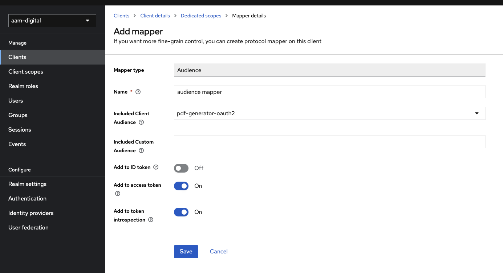

# Aam Digital - Export API

## Overview

The export module is responsible for handling various template-based export operations.
This module primarily focuses on generating PDFs for entities within the Aam Digital system.

### Dependencies

This service is using an external template engine to handle placeholder replacement in files and render PDF (or other supported) files.  
See https://carbone.io for more information and the specification [carboneio-api-spec.yaml](../api-specs/carboneio-api-spec.yaml)

## Controllers

### TemplateExportController

REST controller responsible for handling export operations related to templates. It provides endpoints for creating new templates, fetching existing templates, and rendering templates.

#### Specification

[export-api-v1.yaml](../api-specs/export-api-v1.yaml)

### Check if feature is enabled

You can make a request to the API to check if a certain feature is currently enabled and available:

```
> GET /actuator/features

// response:
{
  "export": { "enabled": true }
}
```

If the _aam-services backend_ is not deployed at all, such a request will usually return a HTTP 504 error.
You should also account for that possibility.

## Setup
This module has to be enabled through a feature flag in the environment:
in .env file: `FEATURES_EXPORTAPI_ENABLED=true`

Configure a compatible render api in the environment. 
You can use the default aam-internal implementation but make sure that authentication is configured:

```
aam-render-api-client-configuration:
  base-path: https://pdf.aam-digital.dev
    auth-config:
      client-id: <needs-environment-configuration>
      client-secret: <needs-environment-configuration>
      token-endpoint: <needs-environment-configuration>
      grant-type: <needs-environment-configuration>
      scope: <needs-environment-configuration>
```

### OAuth Proxy & Keycloak Client
In our standard hosted setup, the carbone.io server is protected by an OAUTH proxy.
The Keycloak Client used by our backend to authenticate against this can be reused across different systems.
When initially setting up this infrastructure in a centralized realm (for us "aam-digital"),
make sure the client is set up with the following Mapper:

