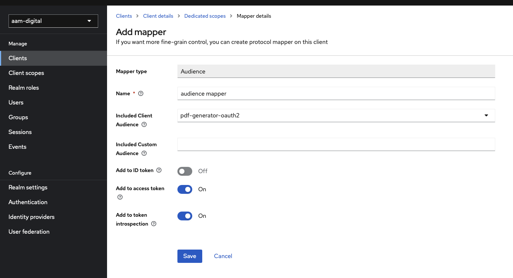

# Aam Digital - Export API

## Overview

The export module is responsible for handling various template-based export operations.
This module primarily focuses on generating PDFs for entities within the Aam Digital system.

### Dependencies

This service is using an external template engine to handle placeholder replacement in files and render PDF (or other supported) files.  
See https://carbone.io for more information and the specification [carboneio-api-spec.yaml](../api-specs/carboneio-api-spec.yaml)

## Controllers

### TemplateExportController

REST controller responsible for handling export operations related to templates. It provides endpoints for creating new templates, fetching existing templates, and rendering templates.

#### Specification

[export-api-v1.yaml](../api-specs/export-api-v1.yaml)

### Check if feature is enabled

You can make a request to the API to check if a certain feature is currently enabled and available:

```
> GET /actuator/features

// response:
{
  "export": { "enabled": true }
}
```

If the _aam-services backend_ is not deployed at all, such a request will usually return a HTTP 504 error.
You should also account for that possibility.

## Setup
This module has to be enabled through a feature flag in the environment:
in .env file: `FEATURES_EXPORTAPI_ENABLED=true`

Configure a compatible render api in the environment. 
You can use the default aam-internal implementation but make sure that authentication is configured:

```
aam-render-api-client-configuration:
  base-path: https://pdf.aam-digital.dev
    auth-config:
      client-id: <needs-environment-configuration>
      client-secret: <needs-environment-configuration>
      token-endpoint: <needs-environment-configuration>
      grant-type: <needs-environment-configuration>
      scope: <needs-environment-configuration>
```

### Batch rendering (ZIP or combined PDF)

The bulk endpoint (`POST /v1/export/render-batch/{templateId}`) requires batch processing to be enabled in the configured Carbone instance.

Carbone does **not** enable this via an aam-services environment variable. It must be configured in Carbone itself:

```json
{
  "nbReportMaxPerBatch": 200
}
```

If this value is missing or `0`, Carbone returns:
`Unable to generate the document. Batch processing deactivated. nbReportMaxPerBatch = 0`

For local development with `docs/developer/docker-compose.yml`, this repository provides
`docs/developer/carbone.config.json`, mounted to `/app/config/config.json` for the `carbone-io` service.

### OAuth Proxy & Keycloak Client
In our standard hosted setup, the carbone.io server is protected by an OAUTH proxy.
The Keycloak Client used by our backend to authenticate against this lives in a centralized realm
and can be reused across different systems.

Its definition ships with the backend, in
[`carbone-render-client.json`](../../application/aam-backend-service/src/main/kotlin/com/aamdigital/aambackendservice/export/keycloak/carbone-render-client.json)
(in the Docker image at `/opt/app/keycloak/carbone-render-client.json`, next to the other Keycloak client
definitions). It creates the client `carbone-<instance>` with the Mapper that the proxy requires, which adds the
proxy's own Keycloak client to the audience of the access tokens.

Import it into the centralized realm as described in the
[README of the Keycloak client definitions](../../application/aam-backend-service/keycloak/README.md#importing),
with these variables:

| Variable | Value |
|---|---|
| `CARBONE_REALM` | Name of the centralized (platform) realm. |
| `INSTANCE_NAME` | Name of the instance. The client id becomes `carbone-<INSTANCE_NAME>`, the `client-id` below. |
| `CARBONE_CLIENT_SECRET` | Secret of the client, the `client-secret` below. |
| `OAUTH2_PROXY_CLIENT_ID` | Client id of the oauth2-proxy in front of Carbone. The Mapper puts it into the access tokens of the render client, which the proxy requires. |

- Every instance imports its own render client into the same realm. With keycloak-config-cli this needs
  `IMPORT_MANAGED_CLIENT=no-delete`, otherwise each import deletes the render clients of the other instances.
- The Mapper only adds the proxy to the access tokens if a client with the id `OAUTH2_PROXY_CLIENT_ID` exists in
  that realm, so create that client first.

Then configure the backend with the id and the secret of the client
(`aam-render-api-client-configuration.auth-config.client-id` and `.client-secret`, see above).

If you set the client up by hand instead, make sure it is set up with the following Mapper:

