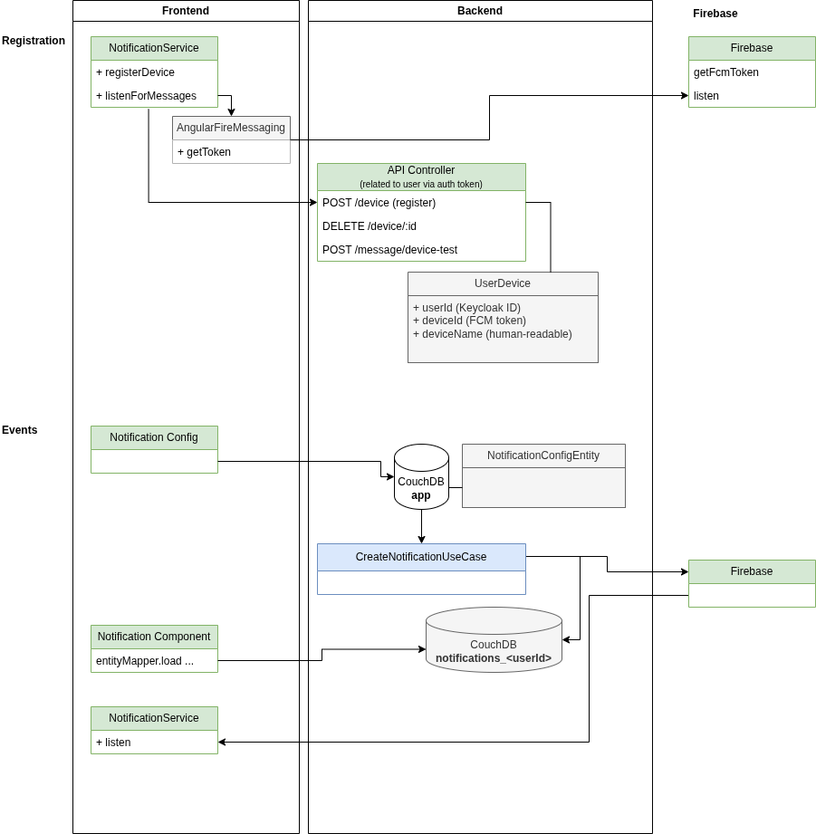

# Aam Digital - Notification API

_for details about the internal
implementation [see README in module code folder](../../application/aam-backend-service/src/main/kotlin/com/aamdigital/aambackendservice/notification/README.md)_

## Overview

The Notification Module is watching for events that are configured to trigger (push) notifications to users.
This module watches for database changes and creates notification events which can be sent through various channels:

- **Push Notifications** through Firebase
- **"In-App" Notifications** directly in the toolbar of our frontend UI
- _... in the future maybe also email_

### Dependencies

Push Notifications are sent through Firebase Cloud Messaging (FCM).

## API Specification

[notification-api-v1.yaml](../api-specs/notification-api-v1.yaml)

## Usage


-----

## Setup

The following environment variables are required:

```dotenv
FEATURES_NOTIFICATIONAPI_ENABLED=true
DATABASECHANGEDETECTION_ENABLED=true

# Firebase Configuration: Confidential (!)
NOTIFICATIONFIREBASECONFIGURATION_CREDENTIALFILEBASE64=<base-64-encoded-firebase-credential-file>

APPLICATION_BASEURL=<your-instance>.aam-digital.com
# if necessary, you can also override the linkBaseUrl (prefer to use the shared APPLICATION_BASEURL however)
NOTIFICATIONFIREBASECONFIGURATION_LINKBASEURL=https://<your-instance>.aam-digital.com
```

### Firebase Configuration (for Push Notifications)

If you want to send Push Notifications, we rely on Firebase Cloud Messaging (FCM).

1. Create a [Firebase Account](https://console.firebase.google.com/)
2. Create a Firebase Project
3. Select "Cloud Messaging" and "Add a web app" (you can skip the second step of setup through npm)
4. Open the "Project Settings" page
5. Under "Your apps" copy to JSON config object
    1. store this as `assets/firebase-config.json` in the Aam Digital
       frontend (or overwrite the empty sample file in your ndb-setup folder in your deployment)
    2. make sure this is proper json format (i.e. the keys are also in double quotes)
6. Create a Service Account or new key for it
    1. ... through the firebase
       interface [as described here](https://firebase.google.com/docs/admin/setup#initialize_the_sdk_in_non-google_environments)
    2. download the `firebase-credentials.json` with its key
    3. Encode it as base64
       run this to print the encoded file to the console:
       ```bash
       base64 -i firebase-credentials.json
       ```
    4. Copy the output (remove line breaks to make it a single line of encoded text)
    5. Add this as an environment variable: `NOTIFICATIONFIREBASECONFIGURATION_CREDENTIALFILEBASE64` as described above
7. To apply the config restart the container, if necessary

### Config:Permissions

Users need to have certain Entity Permissions in the frontend to be able to access and configure Notifications:

In
the [User Permissions doc](https://aam-digital.github.io/ndb-core/documentation/additional-documentation/concepts/user-roles-and-permissions.html)
`Config:Permissions` in the CouchDB, make sure the following rules are present:

```json
{
  "default": [
    {
      "subject": [
        "NotificationConfig",
        "NotificationEvent"
      ],
      "action": "manage"
    }
  ]
}
```
