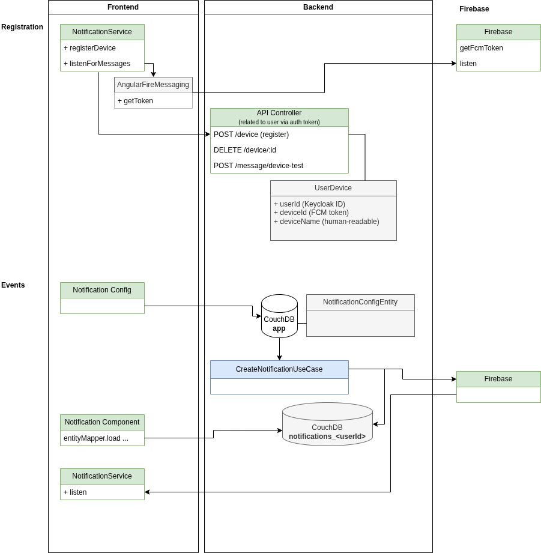

# Aam Digital - Notification API

_for details about the internal
implementation [see README in module code folder](../../application/aam-backend-service/src/main/kotlin/com/aamdigital/aambackendservice/notification/README.md)_

## Overview

The Notification Module is watching for events that are configured to trigger (push) notifications to users.
This module watches for database changes and creates notification events which can be sent through various channels:

- **Push Notifications** through Firebase
- **"In-App" Notifications** directly in the toolbar of our frontend UI
- **Email Notifications** through SMTP (optional)

### Dependencies

Push Notifications are sent through Firebase Cloud Messaging (FCM).

## API Specification

[notification-api-v1.yaml](../api-specs/notification-api-v1.yaml)

### Check if feature is enabled

You can make a request to the API to check if a certain feature is currently enabled and available:

```
> GET /actuator/features

// response:
{
  "notification": { "enabled": true }
}
```

If the _aam-services backend_ is not deployed at all, such a request will usually return a HTTP 504 error.
You should also account for that possibility.

## Usage



---

## Setup

The following environment variables are required:

```dotenv
FEATURES_NOTIFICATIONAPI_ENABLED=true
FEATURES_NOTIFICATIONAPI_MODE=firebase    # delivery mode for push notifications
FEATURES_NOTIFICATIONAPI_EMAIL_ENABLED=false  # set true to enable email notifications

# Required for email notifications (SMTP)
NOTIFICATION_EMAIL_FROM=notifications@your-instance.org
SPRING_MAIL_HOST=<smtp-host>
SPRING_MAIL_PORT=587
SPRING_MAIL_USERNAME=<smtp-username>
SPRING_MAIL_PASSWORD=<smtp-password>
SPRING_MAIL_PROPERTIES_MAIL_SMTP_AUTH=true
SPRING_MAIL_PROPERTIES_MAIL_SMTP_STARTTLS_ENABLE=true

# Recommended for email notifications (email content)
NOTIFICATION_EMAIL_SUBJECTPREFIX=Aam Digital

# Required for email notifications (lookup recipient addresses in Keycloak)
KEYCLOAK_SERVERURL=https://<your-keycloak-url>
KEYCLOAK_REALM=<your-realm>
KEYCLOAK_CLIENTID=<service-client-id>
KEYCLOAK_CLIENTSECRET=<service-client-secret>

# Firebase Configuration: Confidential (!)
NOTIFICATIONFIREBASECONFIGURATION_CREDENTIALFILEBASE64=<base-64-encoded-firebase-credential-file>

APPLICATION_BASEURL=<your-instance>.aam-digital.com
# if necessary, you can also override the linkBaseUrl (prefer to use the shared APPLICATION_BASEURL however)
NOTIFICATIONFIREBASECONFIGURATION_LINKBASEURL=https://<your-instance>.aam-digital.com
```

The email "manage notification settings" link is fixed to `https://<base-url>/user-account?tabIndex=1`
and derived from `APPLICATION_BASEURL`.

Database change-detection is activated automatically when notification (or reporting) is enabled;
no separate flag needs to be set.

Notes:

- Email notifications are only sent for users with `channels.email=true` in their `NotificationConfig:*` document.
- If email is enabled but a user has no email address in Keycloak, that notification is skipped for email delivery.

### Runtime Email Template Override

The backend loads the notification email template from a fixed runtime location first and falls back
to the bundled classpath template if no mounted file exists.

- Runtime template path in container:
  `/opt/app/templates/notification/create-notification-email-template.html`
- Classpath fallback:
  `src/main/resources/notification/create-notification-email-template.html`

Example volume mount:

```yaml
volumes:
  - ./config/aam-backend-service/templates:/opt/app/templates:ro
```

Important:

- Template changes require a container restart.
- The backend does not manage logo files or inline image attachments.
Template authors can embed images directly in the HTML template (for example as data URIs or remote image URLs).

### Permission-Aware Notifications (optional)

To filter notifications based on entity-level permissions (so users only receive notifications for entities they can access),
configure the connection to the replication-backend:

```dotenv
AAMREPLICATIONBACKENDCLIENTCONFIGURATION_BASEPATH=http://replication-backend:5984
AAMREPLICATIONBACKENDCLIENTCONFIGURATION_BASICAUTHUSERNAME=<admin-username>
AAMREPLICATIONBACKENDCLIENTCONFIGURATION_BASICAUTHPASSWORD=<admin-password>
```

If these variables are not set, notifications are sent without permission filtering
(all users matching a notification rule receive the notification regardless of entity access).
This is the expected default for systems without access control (no `Config:Permissions` document configured).
To explicitly disable permission filtering set `AAMREPLICATIONBACKENDCLIENTCONFIGURATION_BASEPATH=` (empty value).

When the replication-backend is configured but temporarily unavailable, notifications are **not** sent
(fail-closed) to avoid leaking data to unauthorized users.

### Firebase Configuration (for Push Notifications)

If you want to send Push Notifications, we rely on Firebase Cloud Messaging (FCM).

1. Create a [Firebase Account](https://console.firebase.google.com/)
2. Create a Firebase Project
3. Select "Cloud Messaging" and "Add a web app" (you can skip the second step of setup through npm)
4. Open the "Project Settings" page
5. Under "Your apps" copy to JSON config object
   1. store this as `assets/firebase-config.json` in the Aam Digital
      frontend (or overwrite the empty sample file in your ndb-setup folder in your deployment)
   2. make sure this is proper json format (i.e. the keys are also in double quotes)
6. Create a Service Account or new key for it
   1. ... through the firebase
      interface [as described here](https://firebase.google.com/docs/admin/setup#initialize_the_sdk_in_non-google_environments)
   2. download the `firebase-credentials.json` with its key
   3. Encode it as base64
      run this to print the encoded file to the console:
      ```bash
      base64 -i firebase-credentials.json
      ```
   4. Copy the output (remove line breaks to make it a single line of encoded text)
   5. Add this as an environment variable: `NOTIFICATIONFIREBASECONFIGURATION_CREDENTIALFILEBASE64` as described above
7. To apply the config restart the container, if necessary

### Config:Permissions

Users need to have certain Entity Permissions in the frontend to be able to access and configure Notifications:

In
the [User Permissions doc](https://aam-digital.github.io/ndb-core/documentation/additional-documentation/concepts/user-roles-and-permissions.html)
`Config:Permissions` in the CouchDB, make sure the following rules are present:

```json
{
  "default": [
    {
      "subject": ["NotificationConfig", "NotificationEvent"],
      "action": "manage"
    }
  ]
}
```
