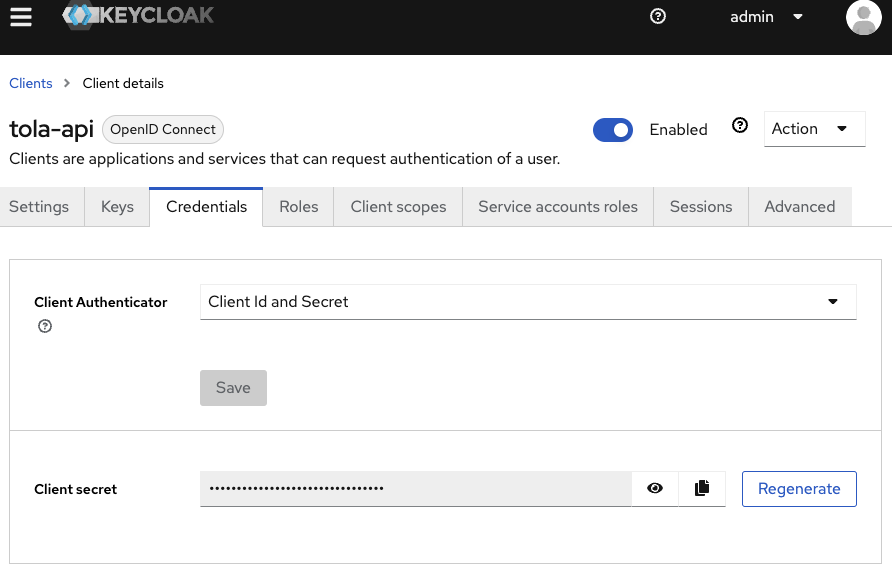

# Aam Digital - Reporting / Query API

An API to calculate "reports" (e.g. statistical, summarized indicators) based on entities in the primary database of an Aam Digital instance.

This service allows to run SQL queries on the database.
In particular, this service allows users with limited permissions to see reports of aggregated statistics across all data (e.g. a supervisor could analyse reports without having access to possibly confidential details of participants or notes).

-----

## API access to reports

Reports and their results are available for external services through the given API endpoints ([see OpenAPI specs](../api-specs/reporting-api-v1.yaml)). Endpoints require a valid JWT access token, which can be fetched via OAuth2 client credential flow.

### Initial setup of an API integration

1. Request client_id and client_secret from server administrator (--> admin has to [create new client grant in Keycloak](https://www.keycloak.org/docs/latest/server_admin/#_oidc_clients))
  1. check "Client authentication" toggle
  2. for "Authentication flow" only "Service accounts roles" needs to be checked
  3. after saving the Client, go to "Clent Scopes" section and create two scopes:
     1. `reporting_read` (Access to reporting-api GET endpoints)
     2. `reporting_write` (Access to reporting-api POST endpoints)
  4. in the Client section, edit the newly created client and add these two scopes in the "Client scopes" tab
  5. from the "Credentials" tab of the client you can now copy the secret:
   

6. Get the realm of your instance (e.g. https://[your_realm].aam-digital.com). This is both the subdomain of systems hosted on aam-digital.com and the Keycloak Realm for authentication (case-sensitive!).

### Access a reporting via API (after setup)

1. Get valid access token using your client secret:

```bash
curl -X "POST" "https://keycloak.aam-digital.net/realms/<your_realm>/protocol/openid-connect/token" \
     -H 'Content-Type: application/x-www-form-urlencoded; charset=utf-8' \
     --data-urlencode "client_id=<your_client_id>" \
     --data-urlencode "client_secret=<your_client_secret>" \
     --data-urlencode "grant_type=client_credentials" \
     --data-urlencode "scopes=reporting_read reporting_write"
```

Check API docs for the required "scopes".
This returns a JWT access token required to provided as Bearer Token for any request to the API endpoints. Sample token:

```json
{
  "access_token": "eyJhbGciOiJSUzI...",
  "expires_in": 300,
  "refresh_expires_in": 0,
  "token_type": "Bearer",
  "not-before-policy": 0,
  "scope": "reporting_read reporting_write"
}
```

2. Request the all available reports: `GET /v1/reporting/reports` (see OpenAPI specs for details)
3. Trigger the calculation of a reports data: `POST /v1/reporting/report-calculation/report/<report-id>`
4. Get status of the report calculation: `GET /v1/reporting/report-calculation/<calculation-id>`
5. Once the status shows the calculation is completed, get the actual result data: `GET /v1/reporting/report-calculation/<calculation-id>/data`

### Subscribe to continuous changes of a report

1. Create an initial webhook (if not already registered): `POST /v1/reporting/webhook`
2. Register for events of the selected report: `POST /v1/reporting/webhook/{webhookId}/subscribe/report/{reportId}`
3. You will receive Event objects to your webhook, including an initial event directly after you subscribe, pointing to the current report data
4. Use the report-calculation-id in the event to fetch actual data from `/v1/reporting/report-calculation/<calculation-id>` endpoint
