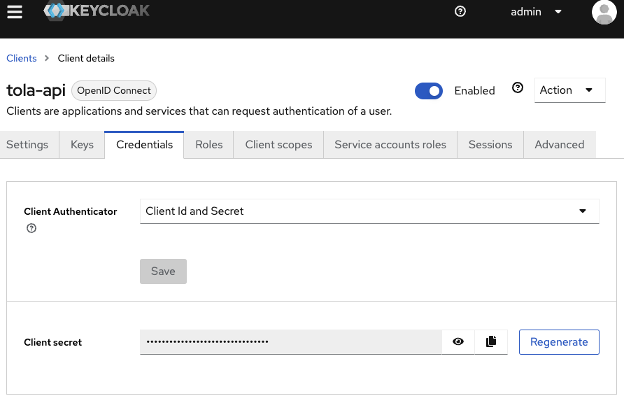

# Aam Digital - Reporting / Query API

An API to calculate "reports" (e.g. statistical, summarized indicators) based on entities in the primary database of an
Aam Digital instance.

This service allows to run SQL queries on the database.
In particular, this service allows users with limited permissions to see reports of aggregated statistics across all
data (e.g. a supervisor could analyse reports without having access to possibly confidential details of participants or
notes).
The queries can also be designed to output raw data for workflows that represent more of an export than a summary.

-----

## API access to reports

Reports and their results are available for external services through the given API
endpoints ([see OpenAPI specs](../api-specs/reporting-api-v1.yaml)). Endpoints require a valid JWT access token, which
can be fetched via OAuth2 client credential flow.

The access token must contain the client scope required by the endpoint:

| Client scope      | Grants access to                                                                  |
|-------------------|-----------------------------------------------------------------------------------|
| `reporting_read`  | all `GET` endpoints (reports, report calculations and their data, webhooks)       |
| `reporting_write` | all `POST` / `DELETE` endpoints (trigger report calculations, configure webhooks) |

Requests with a token that lacks the scope are rejected with `403` (`"errorCode": "insufficient_scope"`).
Users of the Aam Digital app itself (tokens issued to the frontend Keycloak client, see below) are authorized
without these scopes.

1. Get valid access token using your client secret:

```bash
curl -X "POST" "https://keycloak.aam-digital.net/realms/<your_realm>/protocol/openid-connect/token" \
     -H 'Content-Type: application/x-www-form-urlencoded; charset=utf-8' \
     --data-urlencode "client_id=<your_client_id>" \
     --data-urlencode "client_secret=<your_client_secret>" \
     --data-urlencode "grant_type=client_credentials"
```

The client scopes assigned to your client as "Default" scopes are included automatically.
(Scopes assigned as "Optional" are only included if requested explicitly, e.g. with
`--data-urlencode "scope=reporting_read reporting_write"`.)
This returns a JWT access token required to provided as Bearer Token for any request to the API endpoints. Sample token:

```json
{
  "access_token": "eyJhbGciOiJSUzI...",
  "expires_in": 300,
  "refresh_expires_in": 0,
  "token_type": "Bearer",
  "not-before-policy": 0,
  "scope": "reporting_read reporting_write"
}
```

### Manually execute a report calculation
2. Request the all available reports: `GET /v1/reporting/reports` (see OpenAPI specs for details)
3. Trigger the calculation of a reports data: `POST /v1/reporting/report-calculation/report/<report-id>`
4. Get status of the report calculation: `GET /v1/reporting/report-calculation/<calculation-id>`
5. Once the status shows the calculation is completed, get the actual result data:
   `GET /v1/reporting/report-calculation/<calculation-id>/data`

### Subscribe to continuous changes of a report
1. Create an initial webhook (if not already registered): `POST /v1/reporting/webhook`
   - pass your details how to receive the callback upon events
   - you receive the ID of that webhook back in the response (use this to add one or more subscriptions to specific reports)
2. Register for events of the selected report for your webhook: `POST /v1/reporting/webhook/{webhookId}/subscribe/report/{reportId}`
3. After subscribing to a new report your webhook will immediately receive one callback with the latest report-calculation so far, so that you can do an initial import of data.
4. If you want to subscribe to more reports later, you do not have to create a new webhook, you can also `GET /v1/reporting/webhook` to check the list of existing webhooks and update one of these, if you prefer.

_... when data in Aam Digital changes (and once initially directly after you subscribe to a report) ..._

5. You receive an event object sent to your webhook with the current report-calculation reference
   - this does not contain the actual data, but only the reportCalculationId of the result that is ready
6. Use the report-calculation-id in the event to fetch actual data:
   - get metadata like timestamp of the calculation: `GET /v1/reporting/report-calculation/<calculation-id>`
   - get the actual report data: `GET /v1/reporting/report-calculation/<calculation-id>/data`

#### Debouncing of automatic report calculations

When data in Aam Digital changes, affected subscribed reports are not recalculated once per
changed document. Instead, changes are debounced: the calculation runs once no further change
has arrived for a quiet period, so a burst of edits (or a bulk import) results in a single
recalculation reflecting the final state. While changes keep arriving continuously, an
intermediate calculation is still triggered regularly (max wait), so subscribers receive
updates during long-running imports.

This behaviour can be tuned via environment variables / application properties (defaults shown):

| Property                                            | Default | Description                                                              |
|-----------------------------------------------------|---------|--------------------------------------------------------------------------|
| `report-calculation-debounce.quiet-period-seconds`  | `60`    | wait this long after the last change before calculating                   |
| `report-calculation-debounce.max-wait-seconds`      | `300`   | calculate at least this often while changes keep arriving                 |
| `report-calculation-debounce.flush-fixed-delay`     | `10000` | interval (ms) at which pending triggers are checked                       |

Manually triggered calculations (`POST /v1/reporting/report-calculation/report/<report-id>`)
are not debounced and always run immediately.

### Failed report calculations

A report calculation that fails while its queries run ends with status `FINISHED_ERROR`.
If the report's query is invalid, its `errorDetails` contain the query service's explanation
(e.g. `near "FROM": syntax error`), so that the author of the report can fix it.
For any other failure, its `errorDetails` are "Unknown error".
If the report calculation or its ReportConfig cannot be loaded (e.g. because the ReportConfig
cannot be parsed or is not an SQL report), the calculation keeps its status (e.g. `PENDING`).

A failure caused by invalid input, e.g. an invalid query or a ReportConfig that is not an SQL report,
is logged at INFO only.
Any other failure is logged at ERROR.

To see the query service's (SQS) response to any other failed query in the backend log, set the log level of
`com.aamdigital.aambackendservice.reporting.report.sqs` to DEBUG
(e.g. environment variable `LOGGING_LEVEL_COM_AAMDIGITAL_AAMBACKENDSERVICE_REPORTING_REPORT_SQS=DEBUG`).
Note that the response can quote the report's query.

-----

## Setup of the Feature Module

To use this feature in your aam-services backend, the following setup is required:

_(the following steps are automatically handled by the interactive setup
script ([ndb-setup](https://github.com/Aam-Digital/ndb-setup)) also)_

1. Set up necessary environment variables (e.g. using an `application.env` file for docker compose under
   `config/aam-backend-service/application.env` from the root folder where the "docker-compose.yml" exists):
    - see [example .env](/templates/aam-backend-service/application.template.env)
    - `FEATURES_REPORTING_ENABLED=true` — enables this module (default `true` in the template)
    - `CRYPTO_CONFIGURATION_SECRET` — a random secret used to encrypt data

### Check if feature is enabled

You can make a request to the API to check if the reporting feature is currently enabled and available:

```
> GET /actuator/features

// response:
{
  "reporting": { "enabled": true }
}
```

If the _aam-services backend_ is not deployed at all, such a request will usually return a HTTP 504 error.
You should also account for that possibility.
2. Enable the backend in the overall docker compose setup as described in the ndb-setup
   README [here](https://github.com/Aam-Digital/ndb-setup?tab=readme-ov-file#set-up-api-integration)
    - or, if it was already enabled, re-up the docker compose and confirm the new containers and environment are running
3. Create `ReportConfig:` entities to define specific reports
    - the API / backend reports only support the `"mode": "sql"`
    - for details on report definitions,
      see https://aam-digital.github.io/ndb-core/documentation/additional-documentation/how-to-guides/create-a-report.html
4. Make sure the users who are supposed to access the reports in the frontend have permission to view `ReportConfig`
   entities
5. Within the app, users can now execute sql-based reports and see calculated results (configuration for the view in
   Config:CONFIG_ENTITY `"view:report": {"component": "Reporting"}`)

### Initial setup of an API integration

1. Create a Keycloak "Client" (--> admin has
   to [create new client grant in Keycloak](https://www.keycloak.org/docs/latest/server_admin/#_oidc_clients))
    1. check "Client authentication" toggle
    2. for "Authentication flow" only "Service accounts roles" needs to be checked
    3. in the Client section, edit the newly created client and add the `reporting_read` and `reporting_write` client scopes
       in the "Client scopes" tab with Assigned type **Default**
       (the backend creates these client scopes on startup, see [Keycloak client scopes](#keycloak-client-scopes) below)
    4. from the "Credentials" tab of the client you can now copy the secret:
       
2. For integration with TolaData:
    - In TolaData, navigate to Data Tables or User Profile and add Aam Digital credentials
    - Get the client_id and client_secret (from the "Credentials" tab of the client created in Keycloak)
    - also
      see [Support Guide: Integration with TolaData](https://chatwoot.help/hc/aam-digital/articles/1726341005-integration-with-tola_data)
      for details of the required URLs

### Keycloak client scopes

The reporting endpoints check the `reporting_read` and `reporting_write` client scopes of the access token
(see [API access to reports](#api-access-to-reports)).
If the backend has admin access to Keycloak (`KEYCLOAK_*` environment variables, see
[third-party-authentication setup](third-party-authentication.md#setup)), it runs these steps on every startup:

- create the `reporting_read` and `reporting_write` client scopes in the realm, if they don't exist yet
  (with "Include in token scope" enabled; they are not assigned to any client automatically)
- for API clients (clients with service accounts) that have one of these scopes only as "Optional" client scope,
  change it to a "Default" client scope, so that existing integrations that don't request the scopes keep working

For this, the service account of the backend's own Keycloak client (`KEYCLOAK_CLIENTID`, usually `aam-backend`) needs
the `realm-management` role `manage-clients`. The definition of that client that ships with the backend
([`aam-backend-client.json`](../../application/aam-backend-service/keycloak/aam-backend-client.json), see its
[README](../../application/aam-backend-service/keycloak/README.md)) grants it.
If Keycloak admin access is not configured or permissions are missing, the backend logs a warning and starts anyway;
then create and assign the client scopes manually in the Keycloak admin console.

> **Upgrade prerequisite:** before upgrading an existing instance to the version that enforces these scopes,
> give the `aam-backend` service account the `manage-clients` role (or `realm-admin`) and make sure the
> `KEYCLOAK_*` variables are set.
> Otherwise, API clients that have the reporting scopes only as "Optional" and do not request them explicitly
> are denied access (`403`) until the permission is added and the backend is restarted,
> or until the scopes are assigned to them as "Default" manually.

Tokens issued to the frontend client (the `azp` claim) are authorized without the reporting scopes,
because the app runs report calculations for its users.
The frontend client is `app` by default and can be changed with the environment variable
`AAMSECURITY_FRONTENDCLIENTID`.
