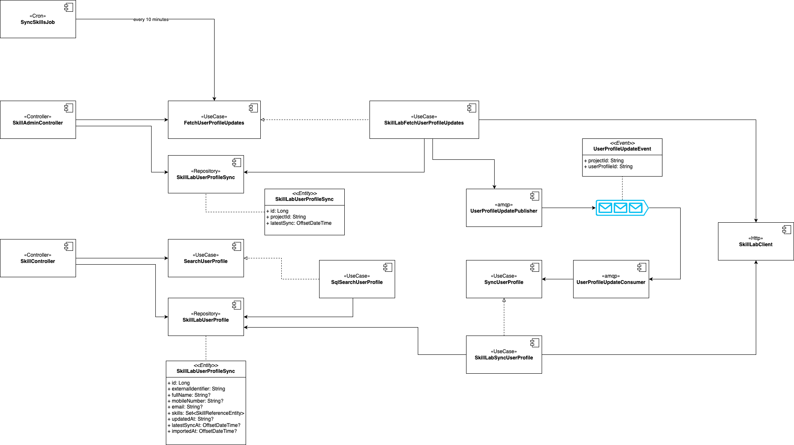

# Aam Digital - Skill Integration API

An API to fetch external profiles from another system (specifically a skill tagging platform)
and import certain properties from matched external records into our entities via the frontend.

-----

## Architecture



## Setup

### Provide environment configuration for skill module

You can find the latest version of the needed configuration in the package `aambackendservice.skill.di`.
The classes with the `@ConfigurationProperties` defines the needed properties.

An example configuration would be:

#### Disable the Skill feature: (default behaviour)

```yaml
features:
  skill-api: disabled
```

#### Enable Skill feature with connection to SkillLab

Here an example configuration for the SkillLab project `42`

```yaml
features:
  skill-api: skilllab

skilllab-api-client-configuration:
  base-path: https://skilllab.app/<some-api-path>/project/42
  api-key: this-is-a-secret
  project-id: 42
  response-timeout-in-seconds: 30 # (default value)

```

### Configure permissions in the authentication system (Keycloak)

Example for the realm: `dummy-realm`

#### Setup Realm roles

- Open the Keycloak user interface and navigate to the `dummy-realm`
- Go to `Realm roles`
- Create two new roles by clicking on `Create role`:
  - `skill_admin`
  - `skill_reader`
- assign role to the `User(s)` or `Group(s)` who should be able to access the external profiles data

#### Add roles mapper for clients

It's necessary to add the roles to the JWT token to verify the roles in the backend.

For that, add an `roles mapper` for each client that sends requests to the skill api.
This should usually be the `app` client

- Open the Keycloak user interface and navigate to the `dummy-realm`
- Go to `Clients`
- Open the `app` client
- Switch to tab `Client scopes`
- Add the pre-defined client scope `roles` with Assigned Type `default`

## Using the API

_see [api-specs/skill-api](../api-specs/skill-api-v1.yaml)_

### Check if feature is enabled

You can make a request to the API to check if a certain feature is currently enabled and available:

```
> GET /actuator/features

// response:
{
  "skill": { "enabled": true }
}
```

If the _aam-services backend_ is not deployed at all, such a request will usually return a HTTP 504 error.
You should also account for that possibility.

### Configuration in Frontend
Define an Entity attribute of dataType "external-profile" to integrate the API in the application for users.
Refer to [external-profile.datatype](https://github.com/Aam-Digital/ndb-core/blob/master/src/app/features/skill/external-profile.datatype.ts) for required config details.
