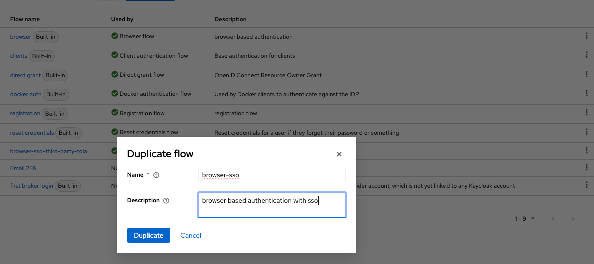
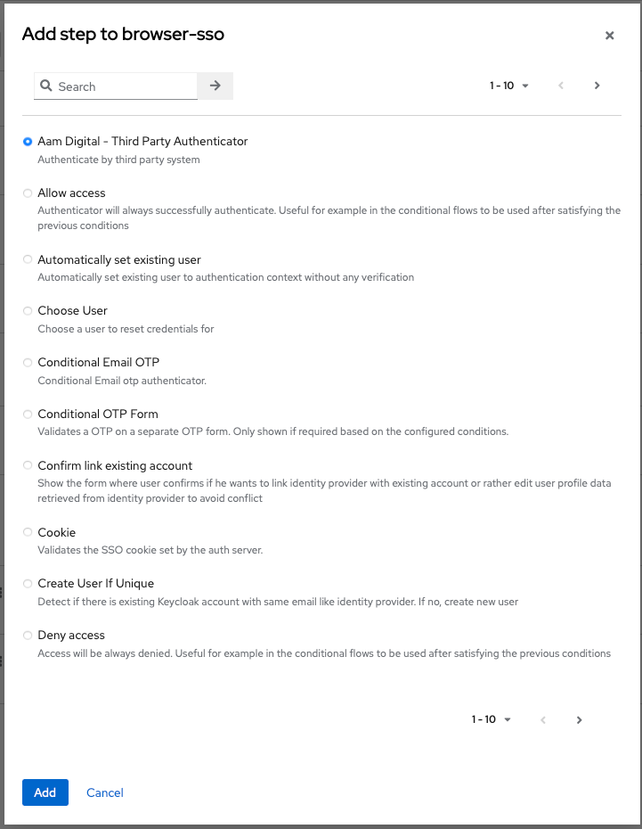
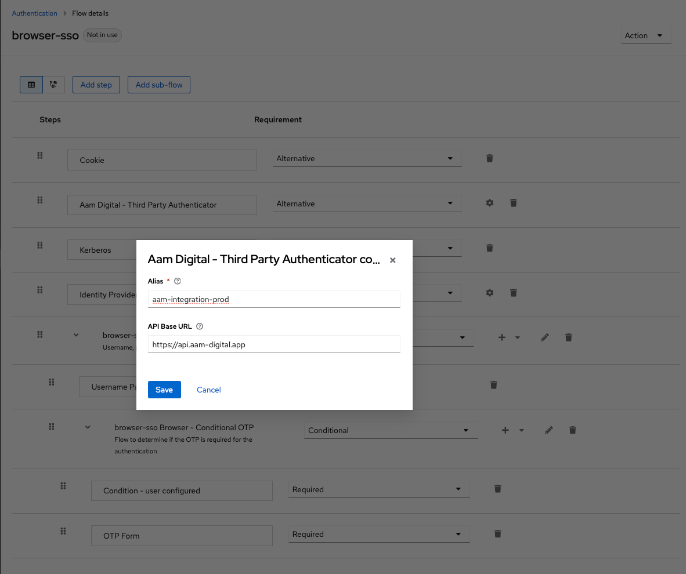
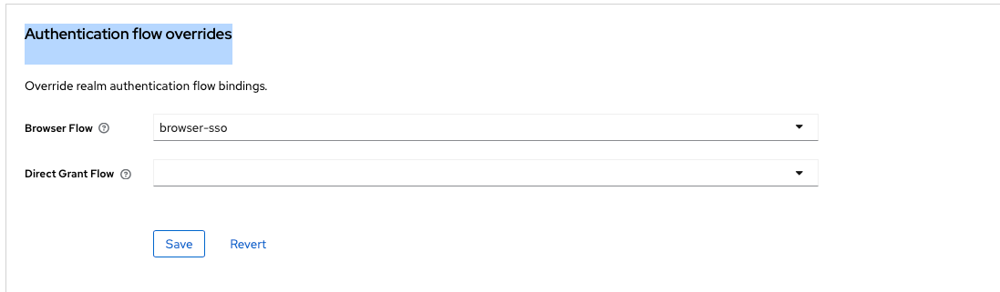

# Aam Digital - Third-Party Authentication / "Single-Sign-On" Integration
Allow another platform's users to log into Aam Digital with their (external) user accounts.
This enables a deeper integration with other systems like TolaData, as users only have to maintain one account.

## Overview
This flow enables other trusted authentication systems to sign-in users on their own.
For example:

- **System A:** Aam Digital system with a dedicated user database and authentication solution.
- **System B:** Other platform which is a partner for your system but also has a user database and an authentication solution.

1. User U1 from System B now wants to switch into your System A, but without sign-up or sign-in again. System B already identified the user U1.
2. System B creates a session on System A for the user U1 in the background (making an API request to the module described here).
3. User U1 is forwarded to the System A with a valid session identifier as payload.
4. The authentication solution from System A is validating the session information.
5. If necessary, System A automatically creates a new User U1 in the user database
6. System A signs in the user U1. The user does not have to enter a password on System A.

If there is already an account with the given email in Aam Digital, an access token is generated to log in as that existing user.

If no user with the given email exists, a new user is created in Aam Digital's Keycloak
and a new "User" entity is created in the CouchDB, linked to that Keycloak user.

### Dependencies
The Keycloak server requires a special Authenticator: [see keycloak-third-party-authentication](/application/keycloak-third-party-authentication/README.md)

### API Specification
_see [api-specs/third-party-authentication-api](../api-specs/third-party-authentication-api-v1.yaml)_

### Check if feature is enabled

You can make a request to the API to check if a certain feature is currently enabled and available:

```
> GET /actuator/features

// response:
{
  "third-party-authentication": { "enabled": true }
}
```

If the _aam-services backend_ is not deployed at all, such a request will usually return a HTTP 504 error.
You should also account for that possibility.


-----
## Setup
The backend module requires environment variables to access the Keycloak server:
```dotenv
FEATURES_THIRDPARTYAUTHENTICATION_ENABLED=true

KEYCLOAK_REALM=dummy-realm
KEYCLOAK_CLIENTID=aam-backend
KEYCLOAK_CLIENTSECRET=1234 # get this from the Keycloak client settings
KEYCLOAK_SERVERURL=https://keycloak.aam-digital.net

APPLICATION_BASEURL=dev.aam-digital.net # the base domain of the Aam Digital application to build redirect URLs
```

Note that you need a Keycloak Client that our Backend can use to authenticate itself against the Keycloak server.
This should be different from the Keycloak Client shared with an external system, which this uses to authenticate itself against our API.

If the `aam-backend` Keycloak Client does not exist in your realm yet, create it:
- Go to the Keycloak Admin Console and create a new Client
   - enable "Client authentication"
   - check only "Service Accounts roles" for Authentication flow
- After creating the client, open its details and go to the "Service accounts roles" tab
   - Add "realm-admin" role to the client, to allow the backend to create users in Keycloak
- Add "roles" as a "Client Scope" for the client, so that the roles are included in the JWT token.

### Keycloak configuration
You need to configure your Keycloak Realm to support the third-party-api.
Check out the provider: [application/keycloak-third-party-authentication](../application/keycloak-third-party-authentication/)_

#### Enable the third-party-authentication provider in Keycloak
The custom Keycloak Provider is already enabled in the default aam-keycloak image.

You should create a Keycloak Client in the Realm for our Backend API to access and administer Keycloak users.
This is different from the Client shared with the external system!

#### Set up Keycloak Client for external system
1. Create a Keycloak Client in the realm to be used by the external system to authenticate itself against our API.
   - _if there already is a client for API integration with the "reporting" module, this can also be reused_
2. Create the Keycloak User Role "third-party-authentication-provider"
3. Add this role as a "Service Account Role" for the client.
4. Add "roles" as a "Client Scope" for the client, so that the roles are included in the JWT token. Make sure this is set to "Default" (not "Optional"). 

#### Create an Authentication Flow
1. Go to the `Authentication` settings in your Realm and copy the default `browser` flow and name it `browser-sso`.

2. Click on `Add step` and select `Aam Digital - Third Party Authenticator`. It will be placed at the end of the list.

3. Now move the `Aam Digital - Third Party Authenticator` block between `Cookie` and `Kerberos`.
4. Set the `Requirement` to `Alternative`
5. Click on the settings icon on the right to configure:
   - **Alias** to any name of the API / system
   - **API-Base Url** to the API module URL of the aam-services backend, e.g. `https://my-realm.aam.digital.app/api` (don't add API version or exact endpoints)


Enable this flow:
- Click the three dots to the right of the new "browser-sso" flow in the "Authentication" list and select "Bind flow" -> "Browser flow"
- OR: Switch to: `Clients` -> `app` -> `Advanced` and scroll down to `Authentication flow overrides`.
   - Select the `browser-sso` flow here:
   

Done. The Third-Party-Authentication from an external system should now be usable.


### Aam Digital app & permissions setup
When a new account is created, that user does not have any roles assigned.
To give at least basic access (to see the app "Config" doc and therefore the UI), 
you should define the `"default"` role in your `Config:Permissions` configuration doc in the CouchDB and allow at least access to "Config".

-----
## Usage
You may use [Insomnia](https://insomnia.rest/) to test the API.
Basic API Requests are pre-defined for use: TODO

1. `POST /api/v1/third-party-authentication/session`
   - to create a new session for a user to log in without password
2. Redirect the user to the `entryPointUrl` returned in the response.
3. The user will be automatically authenticated
   1. Keycloak extracts the sessionId and sessionToken from the URL
   2. Keycloak validates the session with the Aam Digital API (`GET /api/v1/third-party-authentication/session/{sessionId}`)
      1. Aam Digital API finds the matching (via email) user in our system or creates a new Keycloak user
      2. Aam Digital API marks the session as used (invalidating it for future requests)
   3. Keycloak issues a valid session and JWT for the user
4. User is redirected to the Aam Digital application and ready to use it
